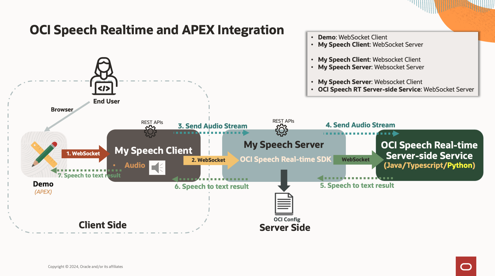

- speechRealtimeServer
**setup python enviroment**
```python
conda create --name speechserver python=3.10
conda activate speechserver
```

**install**
```python
pip install -r requirement.txt
pip install libs/oci-2.129.1+preview.1.1805-py3-none-any.whl
pip install libs/oci.ai_speech_realtime-0.2.0-2-py2.py3-none-any.whl
```

**run**
```python
conda activate speechserver
./main
or
./main --port 7892 --ws_port 7891
```

----
- speechRealtimeClient:

**setup python enviroment**
```python
conda create --name speechclient python=3.10
conda activate speechclient
```

**install**
```python
pip install -r requirement.txt
```

**export**
```python
pip install pyinstaller
pip install --upgrade pyinstaller
pyinstaller --onefile main.py
# then copy static files to the same folder of dist/main/main
```

**run**
```python
conda activate speechclient
./main
or
./main --port 7899 --ws_port 7890
```